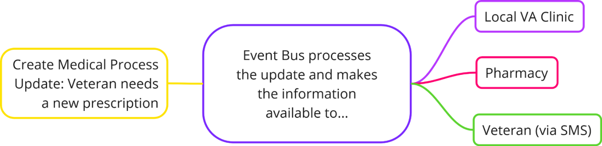

# Enterprise Event Bus

## Welcome to the Enterprise Event Bus
An Event Bus allows a system to publish a stream of changes to its data. Systems that are interested in those data changes can receive the information in real time and use it to send updates to trigger actions, send updates to Veterans, communicate with other internal teams, and more.

## Key Features
- Decoupled communication between services
- Asynchronous and real-time event processing
- Quicker processing for data updates
- Easy integration with existing systems
- A centralized hub for events
- Reliability guarantee with Kafka

Watch this video introduction to Event Bus to learn more about how it works:

<video width="640" height="400" crossorigin="anonymous" controls poster="img/eventBusSlides.png">
  <source src="videos/EventBusVideo/eventBusVideo.mp4" type="video/mp4">
  <track src="videos/EventBusVideo/eventBus.vtt" label="English" kind="captions" srclang="en-us">
</video>

For a more technical breakdown, there is also <a href="videos/phase3_demo.mp4">this video from August 2023</a> about the state of the system at that time.

Here is a visual demo to help show Event Bus in action:

<video width="640" height="400" crossorigin="anonymous" controls poster="img/eventBusDemo.png">
  <source src="videos/DemoVideo/visualDemo.mp4" type="video/mp4">
  <track src="videos/DemoVideo/visualDemo.vtt" label="English" kind="captions" srclang="en-us">
</video>

## Why use the Enterprise Event Bus?

- Show value by measuring success.
- Help Veterans meet unmet needs.
- Spend resources wisely.
- Modernize and simplify systems.
- Provide transparency by supporting easy reporting.
- Provide peace of mind with no silent failures.

Teams can use the Enterprise Event Bus to generate events based on state changes to the data they own and publish them on an event bus. Consumers are free to consume those events and react accordingly. More specifically, with the Enterprise Event Bus:

- Event producers don’t need to know who the interested consumers are and therefore don’t need to keep growing their outbound complexity.
- Multiple consumers may receive and act on an event; it’s not just an asynchronous queue sitting between a single producer and consumer.

## Event Bus is Suitable for:
- Large enterprises with multiple services
- Organizations seeking to reduce system coupling
- Teams looking to implement event-driven architectures

## Is the Event Bus a Good Fit for You?

Before you make further plans to leverage enterprise events, you should evaluate if your system is the right fit for event-driven architecture. Please read the content below, which describes the sorts of systems that would benefit (or not benefit) from enterprise events.

## The Enterprise Event Bus is a good fit if:

Your system relies on **heavy orchestration**: 
Coordinating multiple systems or services can become a challenging task, especially when some individual components lack reliability. This can lead to (partial) failures due to delayed status responses, unclear errors, or frequent retry attempts. A well-considered event-driven solution can greatly enhance the quality and performance of such systems.

Your system relies on **polling, due to high latency or infrequent processes**: 
Repeatedly querying resources can lead to unnecessary resource consumption and increased network traffic. Instead of periodically checking for updates, systems can be designed to react to events as they occur. This reduces overall latency and ensures that actions, such as user notifications, are taken promptly.

Your system needs to perform **batch processing**: 
Batch processing introduces delays, as data changes accumulate before being processed as a group. Allocating resources to perform the batch process can also lead to resource spikes and inefficient usage of resources. Making real-time data available in such systems can greatly improve the timeliness of insights and actions.

Your system is characterized by **tightly coupled components**: 
Instead of direct and synchronous interactions between components, producing and consuming systems operate independently. Consuming systems can act upon events as they are streamed, instead of needing to maintain 1:1 connections and await responses from the producing system. This leads to improved maintainability, scalability, and overall system resilience.

Your system has **delayed or no user notifications**: 
Although there are many systems that would benefit from events, almost any scenario where a side effect of the business event is “to notify the Veteran” could be a candidate for an event stream.

## The Enterprise Event Bus is not a good fit if:

You are interested in a **one-time data sweep**: 
If you just need to search through a data source to identify specific cases for further processing, event-driven systems would introduce unnecessary complexity and overhead. The Enterprise Event Bus is geared towards handling ongoing event streams rather than singular, one-time data analysis tasks.

Your system deals with **simple, linear workflows**: 
If you are dealing with a system that has no significant interaction between components, the overhead of event handling might outweigh the benefits.

Your system is based on a **different programming paradigm**: 
There are many valid reasons to use other architectures, such as synchronous API-based technologies. Event-driven architecture is not the best solution in every scenario.

Your system **lacks well-defined components, or has constantly changing interactions**: 
Systems that are continuously in flux, or don't have well-established boundaries or communication patterns would make it difficult to introduce event-driven designs.

Your event data **is rated as “high” under FISMA (Federal Information Security Modernization Act) and VA system categorization**. The Event Bus is rated at a Medium level under FISMA and VA system categorization, and can only broker data that is rated as Low or Moderate at this time.

 [Learn more about FISMA.](https://security.cms.gov/learn/federal-information-security-management-act-fisma) 
 
 [Learn more about VA system categorization (must be part of VA GitHub organization to view)](https://jubilant-succotash-m55rqe7.pages.github.io/categorization/).

## Reach out to us

If you think the Enterprise Event Bus would be a good fit for your situation, please [reach out](./get-support.md)!

The best way to contact the Event Bus Team is via the [#ves-event-bus Slack channel (must be in the Office of CTO @VA workspace)](https://dsva.slack.com/archives/C042ZQ7JUAX).

## Next steps

Take the next steps to explore and begin using the Enterprise Event Bus:

* Learn more about [which teams would benefit from using event-driven architecture](./get-started.md),
* Understand the [administrative requirements](./administrative-requirements.md) for connecting to the Enterprise Event Bus,
* [Dive deeper into a technical explanation of events](./intro-to-eda.md),
* [Learn how to produce events](./produce-events.md),
* [Learn how to consume events](./consume-events.md), or 
* [Reach out](./get-support.md) to us with questions. 
