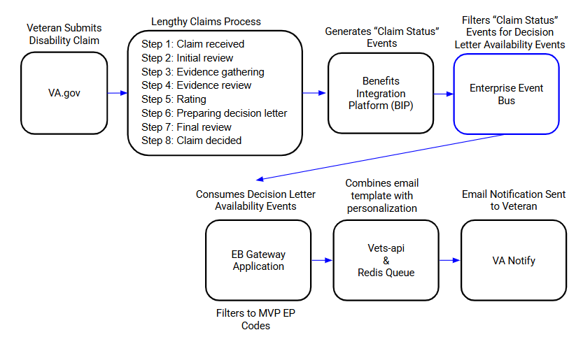

# Enterprise Event Bus

## What is the Enterprise Event Bus

The Enterprise Event Bus (EEB) is a centralized, scalable platform that enables secure, real-time data sharing across VA systems and applications. Unlike a single purpose solution, the Event Bus is designed to unify events from both healthcare and benefits, making them accessible to a wide range of products and teams across VA. By leveraging an event-driven architecture, the Event Bus allows product teams to:

- Share real time data: Deliver critical updates and build more seamless experiences for end-users.
- Integrate systems enterprise wide: Connect to disparate systems across healthcare and benefits, reducing operational silos.
- Ensure reliability: Prevent silent failures and maintain data integrity with built-in safeguards and monitoring. 

The Event Bus is the foundation for creating a connected, integrated VA ecosystem that empowers teams to deliver better outcomes for Veterans and staff while the Event Bus handles reliable, secure data distribution at scale. 

## Why use the Enterprise Event Bus

The Enterprise Event Bus delivers value to Veterans, VA staff, and the VA organization by addressing key challenges and unlocking new opportunities:

Improves Veteran and Staff Experiences

- Ensures Veterans receive coordinated, timely, and accurate updates across all their interactions with VA.
- Eliminates duplicate data entries so that Veterans and staff don’t have to enter information repeatedly to get pertinent information immediately.
- Ensures critical updates flow seamlessly across systems.

Accelerates Delivery

- Cuts integration time through standardized connection pattern for integrating with systems.
- Teams can concentrate on what they do best without needing to understand how other systems work.
- Replaces “your turn, my turn” development with a model where all teams can build at the same time.

Drives Operational Efficiency

- Breaks down silos by enabling seamless data sharing between healthcare and benefits systems.
- Supports smarter use of resources by lowering the cost and complexity of system integrations.

Enables Enterprise-Scale Resilience

- Handles high volumes of events across multiple mission critical domains, ensuring VA can scale to meet future demands.
- Strengthens system resilience by preventing cascading failures when individual components experience issues. 
- Provides transparency through real-time monitoring, reporting, and system health visibility.

## Determining if the Event Bus is Right for You

Before you make further plans to leverage enterprise events, you should evaluate if event-driven architecture is the right fit for your system. Please read the content below, which describes the sorts of systems that would benefit from enterprise events.

<table class="fit-table">
    <thead>
        <tr>
            <th class="good-fit-header">Event Bus is a Good Fit if...</th>
            <th class="not-fit-header">Event Bus is Not a Good Fit if...</th>
        </tr>
    </thead>
    <tbody>
        <tr>
            <td class="good-fit-cell">
                Your system has multiple tightly connected parts that need to communicate frequently and independently. Events help decouple these parts so the system stays responsive even if one component is delayed or updated.
                <em>Example: A benefits system where claims processing, appointment scheduling, eligibility checks, pharmacy orders, and referrals all interact but evolve separately.</em>
            </td>
            <td class="not-fit-cell">
                Your system is simple, changes frequently, or has loosely defined interactions.
                <em>Example: A form that collects patient feedback, or a prototype platform for testing various intake workflows.</em>
            </td>
        </tr>
        <tr>
            <td class="good-fit-cell">
                You want to eliminate inefficient polling and process high volumes of data as it arrives. Events allow real-time updates without delays.
                <em>Example: A care coordination dashboard that reflects provider notes instantly, or a claims platform that processes submissions in real time instead of in overnight batches.</em>
            </td>
            <td class="not-fit-cell">
                Your system checks data infrequently or only needs to run on a schedule.
                <em>Example: A tool that retrieves a Veteran's last lab result, or a monthly report on healthcare usage trends.</em>
            </td>
        </tr>
        <tr>
            <td class="good-fit-cell">
                You need to send real-time updates to users.
                <em>Example: A Veteran gets an instant alert when their benefit status changes or an appointment is confirmed.</em>
            </td>
            <td class="not-fit-cell">
                Timeliness isn't critical and users can wait for updates.
                <em>Example: Notifications about annual benefits re-enrollment.</em>
            </td>
        </tr>
        <tr>
            <td class="good-fit-cell">
                You want parts of your system to work independently. Events allow them to update each other without waiting.
                <em>Example: A pharmacy system that queues refill requests and continues processing others while waiting for prescription verification to complete.</em>
            </td>
            <td class="not-fit-cell">
                Your system relies on synchronous calls between services that wait for a response.
                <em>Example: A benefit calculator that waits for real-time income validation.</em>
            </td>
        </tr>
        <tr>
            <td class="good-fit-cell">
                Your data is Low or Moderate sensitivity as rated by FISMA/VA system categorization.
            </td>
            <td class="not-fit-cell">
                Your data is High sensitivity as rated by FISMA/VA system categorization.
            </td>
        </tr>
    </tbody>
</table>

 [Learn more about FISMA.](https://security.cms.gov/learn/federal-information-security-management-act-fisma) 
 
 [Learn more about VA system categorization (must be part of VA GitHub organization to view)](https://jubilant-succotash-m55rqe7.pages.github.io/categorization/).

## Key Features

- _Asynchronous real-time processing_ ensures fast, efficient, and scalable operations by handling multiple tasks simultaneously without delays. This means your applications can process live data, respond instantly to user interactions, and seamlessly scale to handle more users without slowdowns or bottlenecks.
- _Decoupled communication_ through an Event Bus allows system components to interact independently and react to data changes in near real-time. This improves flexibility, scalability, and resilience by reducing dependencies, enabling faster innovation, minimizing downtime, and eliminating the need for batch processing or scheduled data pulls.
- _Event Bus offers easy integration with existing systems._ Systems can connect to standard tools like Kafka clients, making it easier to send and receive data without changing how they already work.
- _Event Bus functions as a centralized hub for events._ By serving as a shared infrastructure for event-driven communication across VA, it allows systems to exchange both healthcare and benefit data.
- _Built on Apache Kafka providing strong reliability._ The Event Bus ensures high availability, durability, and fault tolerance through features like message replication, persistent storage, and configurable delivery guarantees.

## How it Works

### How Events Flow Through the System

- The Event Bus simplifies how teams share and react to data changes across systems. Here’s how it works: 
  - Event Producers: Systems generate events based on state changes in the data and publish them to the Event Bus
    - Key Benefit: Event producers don't need to know who the interested consumers are and therefore don't need to keep growing their outbound complexity.
  - Event Consumers: Any system can subscribe to these events and take action accordingly
    - Key Benefit: Multiple consumers may receive and act on an event; it's not just an asynchronous queue sitting between a single producer and consumer.
   
### Event Bus Workflow Example

Here is an example of how Event Bus hypothetically could work:

When a Veteran visits their doctor and receives a new prescription, the system publishes an event to the Event Bus. This event instantly updates the local VA clinic’s records for reference for future appointments, notifies the pharmacy to prepare the medication, and sends an SMS to the Veteran letting them know their documents have been updated with their local VA clinic — all at the same time, without manual coordination.

 

 

### Active Use Case: Veterans Notified of Claims Much Earlier with Event Bus

Challenge: After a Veteran files a disability claim, they must wait until they receive their Decision Letter in the mail to learn the outcome, delaying their ability to plan appeals or provide additional information 

Solution: A team that owns the Claims Status Tool on va.gov and the VA Health & Benefits app within the OCTO Benefits Portfolio has partnered with the Event Bus to "listen" for these Decision Letter Availability Events. 

- When a Decision Letter is generated, the Event Bus triggers an immediate email notification to the Veteran, letting them know they can view the letter in their eFolder. 

Impact: Veterans are now notified 7-10 days earlier, giving them more time to plan appeals or satisfy requests for additional information while also reducing uncertainty during the claims process. 

This feature went live in production in late June 2025. It currently sends about 95K emails a week and has a click-through rate greater than 50%.

 

 

### Event Bus Introduction

Watch this video introduction to Event Bus to learn more about how it works:

<video width="640" height="400" crossorigin="anonymous" controls poster="img/eventBusSlides.png">
  <source src="videos/EventBusVideo/eventBusVideo.mp4" type="video/mp4">
  <track src="videos/EventBusVideo/eventBus.vtt" label="English" kind="captions" srclang="en-us">
</video>

### Event Bus Visual Demonstration

For a more technical breakdown, there is also <a href="videos/phase3_demo.mp4">this video from August 2023</a> about the state of the system at that time.

Here is a visual demo to help show Event Bus in action:

<video width="640" height="400" crossorigin="anonymous" controls poster="img/eventBusDemo.png">
  <source src="videos/DemoVideo/visualDemo.mp4" type="video/mp4">
  <track src="videos/DemoVideo/visualDemo.vtt" label="English" kind="captions" srclang="en-us">
</video>

[Learn how to produce events](./produce-events.md)
[Learn how to consume events](./consume-events.md)

## Getting Started

### Next Steps

Take the next steps to explore and begin using the Enterprise Event Bus:

* Understand the [administrative requirements](./administrative-requirements.md) for connecting to the Enterprise Event Bus,
* [Dive deeper into a technical explanation of events](./intro-to-eda.md),
* [Learn how to produce events](./produce-events.md),
* [Learn how to consume events](./consume-events.md), or 
* [Reach out](./get-support.md) to us with questions.

### Reach out to us

If you think the Enterprise Event Bus would be a good fit for your situation, please see our [Contact and Support page](./get-support.md)!

The best way to contact the Event Bus Team is via the [#ves-event-bus Slack channel (must be in the Office of CTO @VA workspace)](https://dsva.slack.com/archives/C042ZQ7JUAX).
