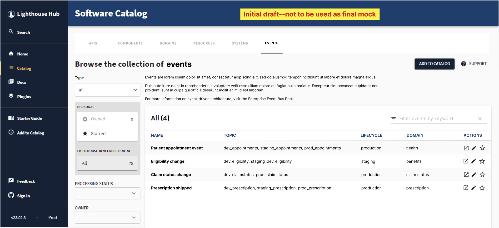
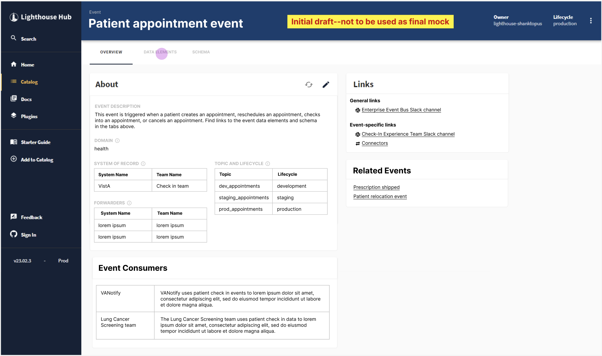
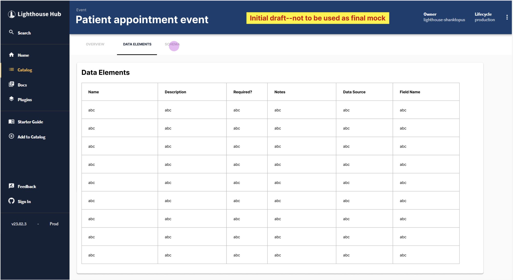

# Event Catalog

## About the Catalog

The [Event Catalog](https://hub.lighthouse.va.gov) is the single source of truth for all events currently published on the Event Bus. The Event Catalog lives on [CODE VA](https://hub.lighthouse.va.gov) (formerly called the Lighthouse Hub), and you will need to be on the VA network to access it.

In the Event Catalog, you’ll find the following information for every event:

- A brief overview of the event, including a description, domain, system of record, the topics it’s published on, expected throughput, the current lifecycle phase it’s in, and what other systems may be consuming it. 
- Data elements: A summary of what each field in an event is.
- Schema: the overall structure of an event payload, described as an [Avro schema](https://docs.oracle.com/cd/E26161_02/html/GettingStartedGuide/avroschemas.html).

## Producing and consuming events from the catalog

Producers add events to the catalog and are responsible for keeping them up to date. You can read more about what to expect as a producer on the [producing events](produce-events.md) page.

Consumers can use the catalog to browse all available events, and view details about each one such as payload structure and the system that produces it. If you find an event in the catalog that you’d like to consume, follow the steps on the [consuming events](consume-events.md) page.

## Event Catalog governance

The Event Catalog uses <a href="https://backstage.io/" target="_blank">Backstage</a> as its framework for hosting and displaying entries. Entries are added to the catalog through the use of `catalog-info.yaml` files that contain information about the source code they represent. You can read more about `catalog-info.yaml` files in the <a href="https://backstage.io/docs/features/software-catalog/descriptor-format" target="_blank">official Backstage documentation</a>. These entries can represent anything from an API endpoint to an overarching system. For the Event Catalog, all entries represent an event that is currently, or was previously, published to the Event Bus.

If you’re interested in producing events and publishing them to the Event Bus, we provide a template for getting started with adding your event to the catalog. You can read more about the template and the information that needs to be added to it on the [producing events](produce-events.md) page.

## Having trouble?

If you find something wrong in our documentation, didn’t find what you were looking for, or have a question or suggestion, please [contact us](get-support.md).

