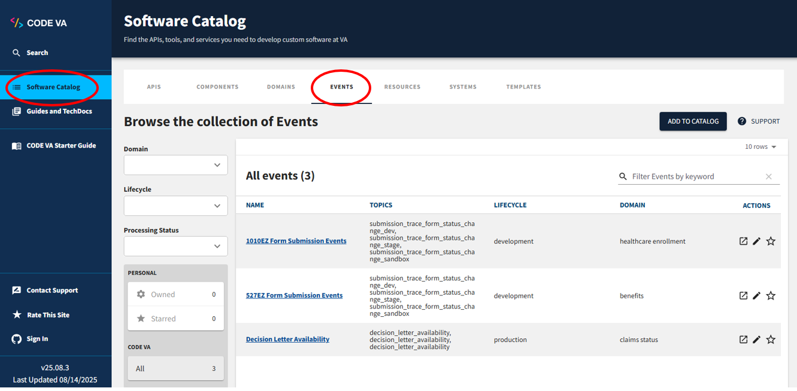
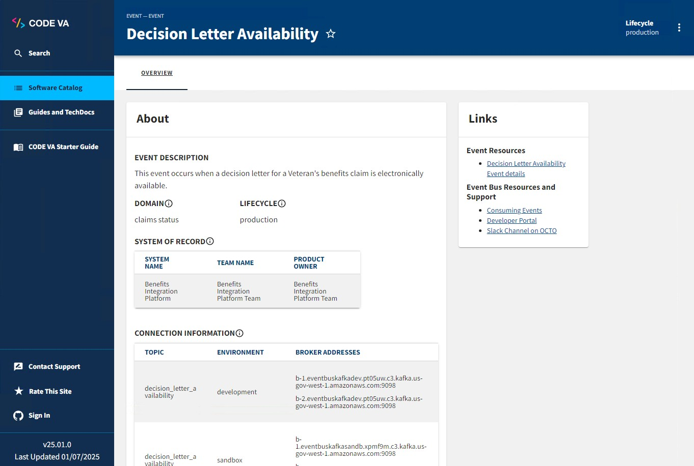

# Event Catalog

## About the Catalog

The Event Catalog is the single source of truth for all events currently published on the Event Bus. The Event Catalog lives on CODE VA (formerly called the Lighthouse Hub).

Visit the CODE VA website (must be on the VA network to view): [https://code.va.gov/](https://code.va.gov/) (click on Software Catalog in left nav and then Events in top nav to display Events list) or use this [direct link](https://code.va.gov/catalog?filters%5Bkind%5D=event&filters%5Buser%5D=all&limit=20).

In the Event Catalog, you’ll find the following information for every event:

* A brief overview of the event, including its: 
    * description
    * VA domain
    * system of record
    * topics
    * expected throughput
    * development lifecycle phase
    * consuming systems
* Schema: the overall structure of an event payload, described as an Avro schema. [Read more about Avro on the Oracle website](https://docs.oracle.com/cd/E26161_02/html/GettingStartedGuide/avroschemas.html).

## Producing and consuming events from the catalog

Producers add events to the catalog and are responsible for keeping them up to date. You can read more about what to expect as a producer on the [Producing Events page](produce-events.md).

Consumers can use the catalog to browse all available events, and view details about each one such as payload structure and the system that produces it. If you find an event in the catalog that you’d like to consume, follow the steps on the [Consuming Events page](consume-events.md).

## Event Catalog governance

The Event Catalog uses <a href="https://backstage.io/">Backstage</a> as its framework for hosting and displaying entries. Entries are added to the catalog through the use of `catalog-info.yaml` files that contain information about the source code they represent. You can read more about `catalog-info.yaml` files in the <a href="https://backstage.io/docs/features/software-catalog/descriptor-format">official Backstage documentation</a>. These entries can represent anything from an API endpoint to an overarching system. For the Event Catalog, all entries represent an event that is currently, or was previously, published to the Event Bus.

If you’re interested in producing events and publishing them to the Event Bus, we provide a template for getting started with adding your event to the catalog. You can read more about the template and the information that needs to be added to it on the [Producing Events page](produce-events.md).

## Having trouble?

If you find something wrong in our documentation, didn’t find what you were looking for, or have a question or suggestion, please [contact us](get-support.md).

